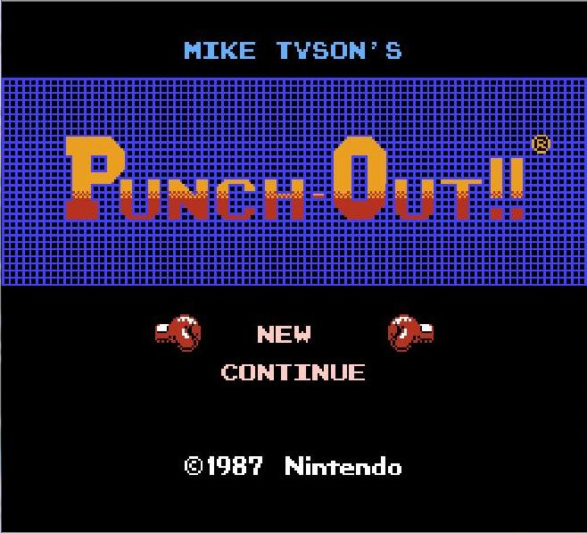
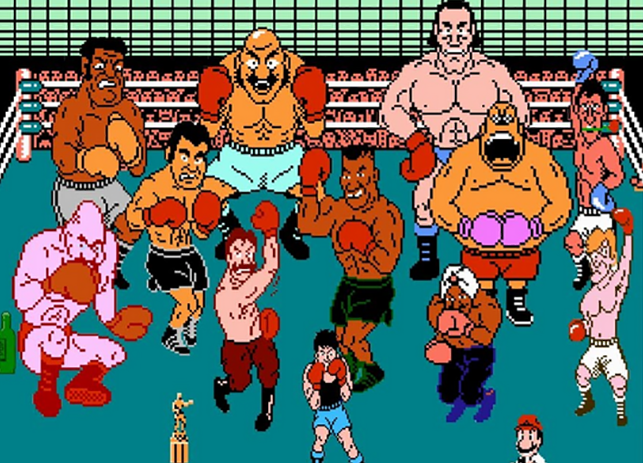

# mike-tysons-knock-out

## WireFrames

  1. Animation on keydown and keyup
2. Audio Tags
  1. Allows for sound effects to happen, onload, and on click events
3. Google Fonts
  1. Because awesome fonts add greatness to your page
4. Pure JS
5. -webkit-linear-gradient

## Approaches to the Game
I first wanted to recreate Nintendo's Mike Tyson Punch Out from 1987...However, once I started building and creating it the game took on a mind of its own (aka my design brain wouldn't shut up). I really like how the original 8bit games look because they remind me of how much time it took to individually draw each image one pixel at a time to make games. Plus who wouldn't remember the frustration of trying to get the original cartridge games to load after they have been played a few times.

I took on a lot of design queues from the game itself with a slight addition of my own as the game progressed...

Using Canvas allowed me to make the game and design it at the same time, which added to appeal for building future games for fun. However, some of the issues are that there is definetly bugs within Canvas itself, possibly still in a Beta stage? Besides that it allowed for a total game feel the entire time. This would be great for creating your own animations later once it has better development. I currently find use in game creation, but the sky is the limit on this element.

To say that I knew what I was doing during the game build is a far stretch...I had plenty of help from other classmates ideas, to tutorials on YouTube to help really figure out how canvas works. At the same time though I got to learn a new skill with canvas and get a much better feel for JS functions and eventListeners.

[YouTube Help](https://www.youtube.com/channel/UCJWX2cGhemrvksuNSanZ9aA)

## Unsolved Problems
